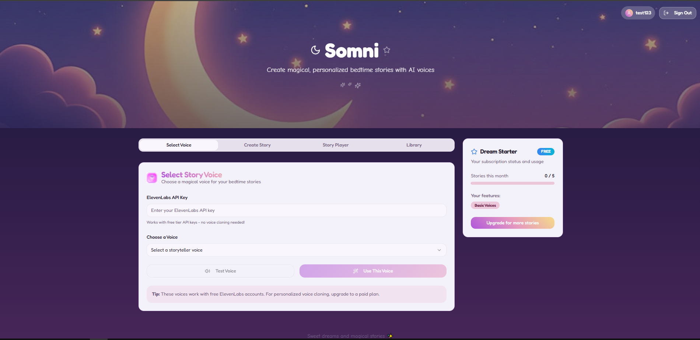
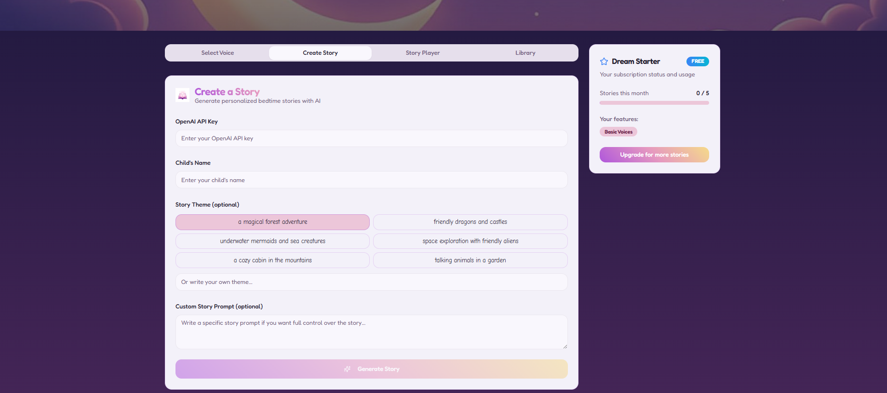
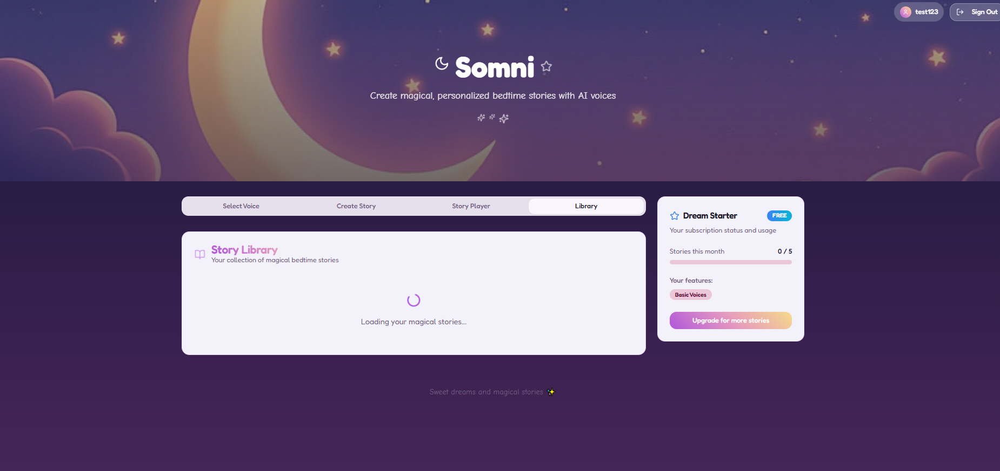

## Somni

AI‑assisted bedtime story generator with selectable voices, a creator workflow, and a personal library. Built with React, TypeScript, Vite, Tailwind, shadcn/ui, and Supabase for auth, storage, and subscriptions.

### Highlights
- **Create stories**: Guided flow to generate and save bedtime stories
- **Select voice**: Choose a narration voice for playback
- **Story library**: Browse, play, and manage saved stories
- **Authentication**: Email/password via Supabase Auth
- **Subscriptions**: Gated features and status handling with Supabase
- **Modern UI**: shadcn/ui + Radix primitives, fully responsive

---

## Screenshots





---

## Quickstart

### Prerequisites
- Node 18+
- npm (or pnpm/yarn/bun)
- A Supabase project (URL + anon key)

### 1) Clone and install
```bash
git clone <your-repo-url>
cd Somni
npm install
```

### 2) Configure environment
Create `.env.local` (or `.env`) in the project root. Vite requires `VITE_` prefixes.
```bash
VITE_SUPABASE_URL=your_supabase_project_url
VITE_SUPABASE_ANON_KEY=your_supabase_anon_key
```

If these variables are missing, the app will throw at startup (see `src/lib/supabase.ts`).

### 3) Set up Supabase schema (optional but recommended)
- See `SUPABASE_SETUP.md` for project configuration
- Apply SQL in `SUBSCRIPTION_SETUP.sql` if you’re enabling subscriptions
- See `SUBSCRIPTION_IMPLEMENTATION_GUIDE.md` for usage details

### 4) Run
```bash
npm run dev
```
Visit the printed local URL (typically `http://localhost:5173`).

### 5) Build & preview
```bash
npm run build
npm run preview
```

---

## Scripts
- `npm run dev`: Start Vite dev server
- `npm run build`: Production build
- `npm run build:dev`: Development build mode
- `npm run preview`: Preview production build
- `npm run lint`: Lint the project

---

## Tech Stack
- React 18, TypeScript, Vite 5
- Tailwind CSS, shadcn/ui, Radix UI
- Supabase (Auth, Database, Storage)
- React Router, TanStack Query
- Zod, react-hook-form
- Recharts, Embla Carousel, Sonner

---

## Project Structure (high level)
```text
src/
  components/           # UI and feature components (StoryGenerator, StoryLibrary, etc.)
  contexts/             # Auth and subscription contexts
  lib/                  # Supabase client, utilities
  pages/                # Routed pages (Index, Pricing, Login, etc.)
  assets/               # Static images
```

---

## Notes for Reviewers
- Subscription flow and gating are implemented with Supabase; see guides in the root for details
- The UI demonstrates modern React patterns and a clean component architecture

---

## License
Add your chosen license here (e.g., MIT) if you plan to open‑source.

