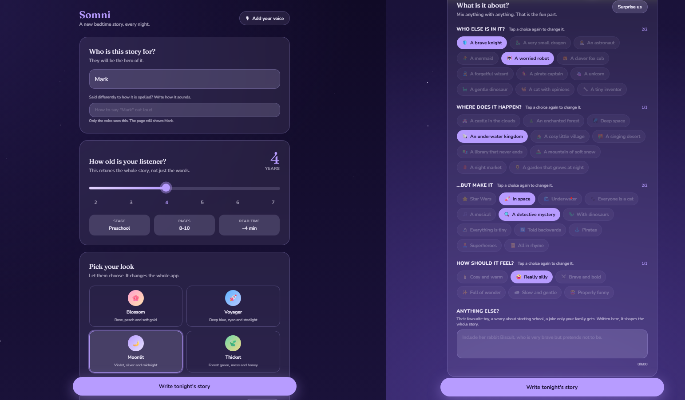
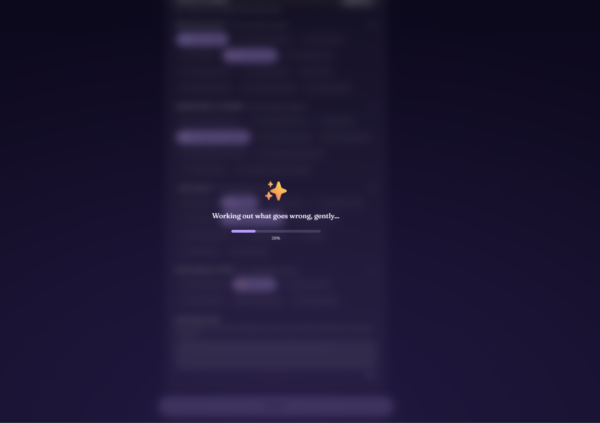
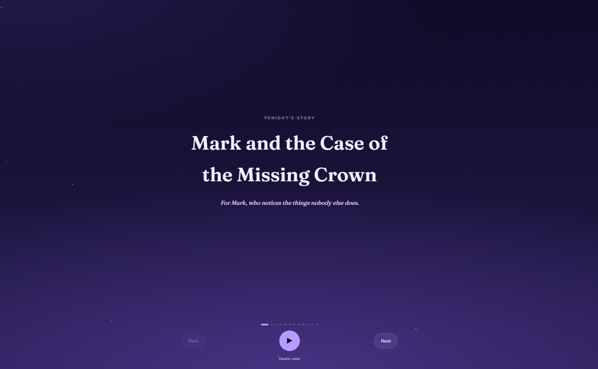
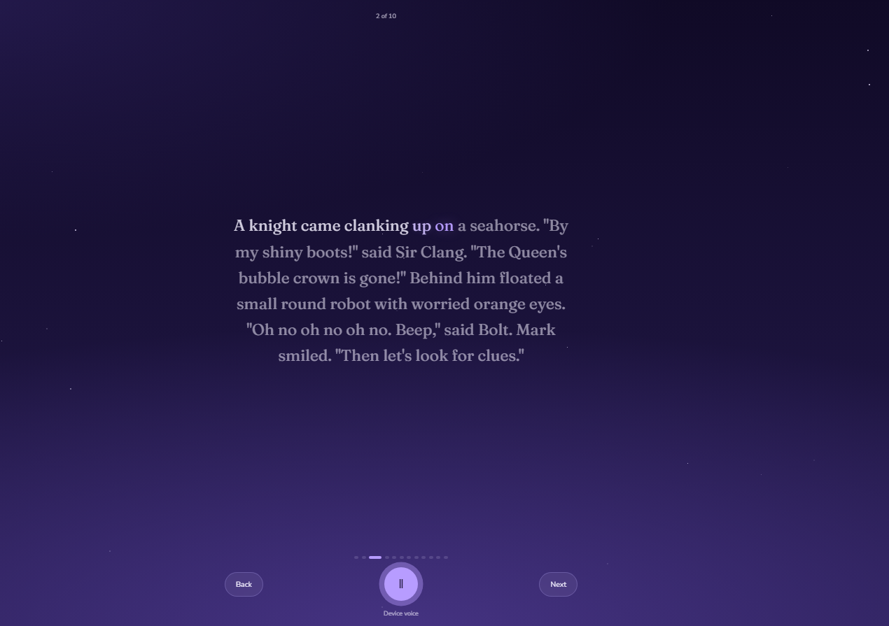
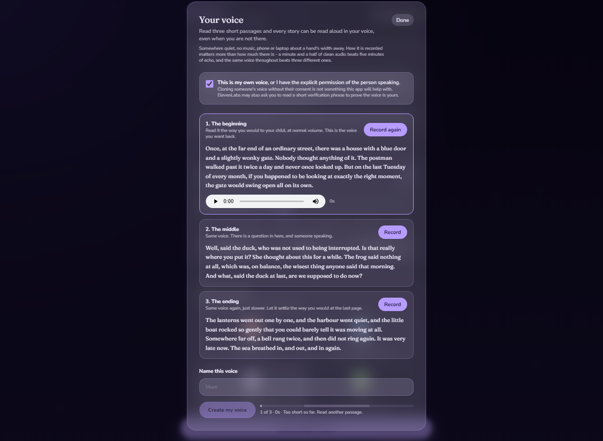

# Somni

**A bedtime story app that writes a brand-new story every night and reads it aloud in your
own voice.** Pick who is in it and where it happens, set your child's age, and Claude writes
an original story tuned to that age — then it comes back narrated by a clone of you, lighting
up each word as it is spoken. No account, no database, nothing stored on a server.

<p>
  
  
  
  
  
  
  
</p>



Bedtime is the same four books on rotation until everyone involved can recite them. Somni
makes a new one in twenty seconds for a four-year-old, a minute or two for a seven-year-old
who gets a subplot: knights and dragons, but make it space. A mermaid detective. Everyone is
a cat. The child is always the hero, by name, and the story lands somewhere calm — every
time, because that part is not left to chance.

---

## The age dial

The dial from 2 to 7 is the whole idea, and it does far more than swap long words for short
ones. Each notch carries its own specification: how many pages, how many words on a page, the
longest sentence allowed, the shape of the plot, how much tension is permitted, which
narrative devices to use, and what to avoid entirely. All of it reaches the model.

| | At two | At seven |
|---|---|---|
| **Shape** | six to eight pages, a warm routine with one small surprise | eleven to fourteen pages, a subplot and a real reversal |
| **Sentences** | eight words at most, subject-verb-object | up to twenty-two, paragraph-level rhythm |
| **Devices** | a refrain the child can say along, sound words to perform | foreshadowing, dry humour, a morally interesting choice |
| **Never** | villains, chases, anyone separated from a grown-up | peril to caregivers, preachiness, a rushed ending |

Retuning all of that lives in one file: [`src/lib/age.ts`](src/lib/age.ts).

Underneath it sits a rule the story cannot break, whatever anyone asks for: **it must leave
the child calmer than it found them.** No cliffhangers, nothing unresolved, and the last two
pages decelerate — sentences shorten, the world quiets, the hero settles. If a requested
element cannot be made bedtime-safe, it keeps its flavour and loses its teeth: a fearsome
monster becomes an enormous, shy one; a battle becomes a contest.

Ask for Star Wars and you get space knights with humming blades and a wise mentor in a
desert, under original names. Same delight, nobody else's characters.

---

## Screens

### Tonight's story

| Building it | Writing it |
|---|---|
| [](assets/main_screen.png) | [](assets/writing_screen.png) |

Forty story elements across four groups — who else is in it, where it happens, *but make it*,
and how it should feel — with hard caps so the story stays focused, and a free-text box the
prompt treats as the most important instruction of all. Their favourite toy, a worry about
starting school, a joke only your family gets.

Four themes, applied live to the whole app, because the person choosing is usually four.

### The reader

| The cover | Mid-story |
|---|---|
| [](assets/reader_cover.png) | [](assets/reader_screen.png) |

One page at a time, in a serif sized for a dark room. The page turns itself when the voice
reaches it. Each word lifts and warms as it is spoken — not a karaoke bar, which is hard to
read in the dark and reads as a game rather than a book.

A story left half-read remembers where it stopped and offers to carry on. Behind **For
grown-ups** sit the reading speed, the page-turn behaviour, a note on how to perform this
particular story, and any ambitious words it used with child-friendly meanings ready.

### Your voice

[](assets/voice_screen.png)

Three short passages, about ninety seconds all told, and every story afterwards can be read
in your voice — on the nights you are not there to read it.

---

## Getting the voice right

This was the hard part, and most of what I assumed turned out to be wrong. The interesting
failures:

**The browser was flattening the recording before it was ever sent.** `getUserMedia` defaults
echo cancellation, noise suppression and automatic gain *on*, because it assumes a video call.
That trio gates quiet passages and compresses loud ones — exactly the dynamic range a clone
learns delivery from. Every processor is now switched off during recording. This mattered more
than any parameter.

**More audio makes an instant clone worse, not better.** ElevenLabs are explicit: one to two
minutes is optimal, and past three "can, in some cases, even be detrimental to the clone."
What it degrades is stability, which is heard as invented words. Somni asks for ninety seconds
and shows a band to land inside rather than a bar to fill.

**Range in does not give range out.** Asking for warm, then comic, then a whisper produces a
muddier clone, not a more versatile one — instant cloning builds a single speaker embedding
and three performances average into one. All three passages are now the same voice, with the
variety in the writing instead.

**Expressiveness and coherence are the same dial, and it is short.** ElevenLabs' own presets
bracket it: narration 0.7 stability, conversational 0.4, character voices 0.3. Pushed to 0.3
this app produced exactly the gibberish that corner is known for. It sits at 0.4 now, with
Steady and Lively either side of it and a **Hear it** button to judge by ear in ten seconds.

**Anything that still slips through is caught.** The alignment data covers every character
sent, so its final timestamp is where the text ends. Audio running past that is audio for
words that were never in the story — measured, a healthy clip overruns by 0.05–0.08 seconds,
so 1.5 is a confident signal. That segment regenerates itself before it reaches the child, and
**Read that again** handles the rest.

And because a speech model reads an unfamiliar name phonetically and gets it wrong, there is a
**sounds like** field. Write `Sur sha` and the voice says Saoirse properly while the page keeps
the real spelling.

---

## Nothing leaves your device

There is no account, no database and no server-side storage. Profiles, stories and the
narrated audio all live in your own browser's IndexedDB. The only things that ever leave are
the story brief and the voice recordings you deliberately submit.

Narration is cached per voice, which means a second reading of the same story costs nothing
and works with the aeroplane mode on.

**On consent.** Cloning a voice requires affirming it is your own or that you have the
speaker's explicit permission, and the API route rejects the request without it — the gate is
not only in the interface. ElevenLabs independently runs its own verification and may ask you
to read a phrase to prove the voice is yours, which the app surfaces rather than hides.

---

## Built with

| | Used for |
|---|---|
| **TypeScript** · **React 19** · **Next.js 16** (App Router) | ~5,200 lines across 23 files; one page, five API routes |
| **Tailwind v4** | themes as CSS custom properties, so one variable swap repaints everything |
| **Claude Opus 5** via `@anthropic-ai/sdk` | story generation with adaptive thinking |
| **Zod 4** | the story schema, enforced as structured output rather than parsed from prose |
| **ElevenLabs** | Instant Voice Cloning, and text-to-speech with character alignment |
| **Web Audio** · **MediaRecorder** | recording, the live level meter, the noise-floor measurement |
| **IndexedDB** | stories, profiles and cached narration, entirely client-side |
| **Cloudflare Workers** via OpenNext | deployment — 1.1 MiB gzipped, runs on the free plan |

### Engineering notes

A few things worth a closer look:

- **Structured output, not prose parsing.** The story arrives as a Zod-validated object —
  pages, moods, a dedication, a goodnight line — so there is no regex anywhere near it. An
  output that will not read back as a story is retried once, automatically, so a parent never
  sees the JSON underneath.
- **`effort` was measured, not assumed.** Against `high` on identical briefs: 23s vs 51s at
  age four, 101s vs 178s at age seven, with both staying inside the age spec every run.
  `medium` won on the only axis that differed.
- **Progress is streamed as server-sent events.** A still screen for a minute reads as broken,
  so the route reports when the model stops planning and starts writing, and sends a character
  count the bar can use honestly.
- **Narration is generated in multi-page segments**, which is what carries a sentence's energy
  over a page turn instead of resetting at every one — and on Eleven v3 is the only way, since
  that model rejects request stitching outright.
- **Word timings come from the API's character alignment**, folded into per-word start and end
  times expressed as offsets into each page's own text. The reader then follows the audio's own
  clock on an animation frame, running 80 ms ahead because `currentTime` is the decode position
  rather than the moment sound leaves the speaker.
- **The next segment is fetched *and decoded* while the current one plays.** Having the bytes
  was never enough; building the element and waiting on its metadata is itself a few hundred
  milliseconds of hole at every seam.
- **Audio is sent as bytes, not base64 in JSON** — a length-prefixed header followed by the raw
  mp3. A third less data, no decoding on the phone, and half the server CPU.

---

## Getting started

```bash
npm install
cp .env.example .env.local   # then add your keys
npm run dev
```

Open http://localhost:3000.

An `ANTHROPIC_API_KEY` is required to write stories. `ELEVENLABS_API_KEY` is optional — without
it the app narrates with the device's built-in speech voice and everything else works unchanged.

```bash
npm run typecheck
npm run lint
npm run build
```

### Cost

A few cents of text per story. Narration runs about $0.10 per 1,000 characters, so a 700-word
story is around 40 cents the first time and free on every replay, since the audio is cached
locally. `ELEVENLABS_TTS_MODEL=eleven_flash_v2_5` roughly halves it, at real cost to warmth.

## Deploying

Set up for **Cloudflare Workers** through the OpenNext adapter, and the free plan is enough —
the app shell is static assets, which never invoke the Worker, and the API routes spend their
time waiting on Anthropic and ElevenLabs rather than burning CPU. Full steps, and why
Cloudflare Pages is not the free alternative it looks like, in [DEPLOY.md](DEPLOY.md).

```bash
npx wrangler login
npx wrangler secret put ANTHROPIC_API_KEY
npx wrangler secret put ELEVENLABS_API_KEY
npm run deploy
```

Nothing in the app is Cloudflare-specific, so it still deploys to Vercel unchanged.

---

Not affiliated with Anthropic or ElevenLabs. Any franchise a story evokes belongs to its owners —
Somni writes originals on purpose.
